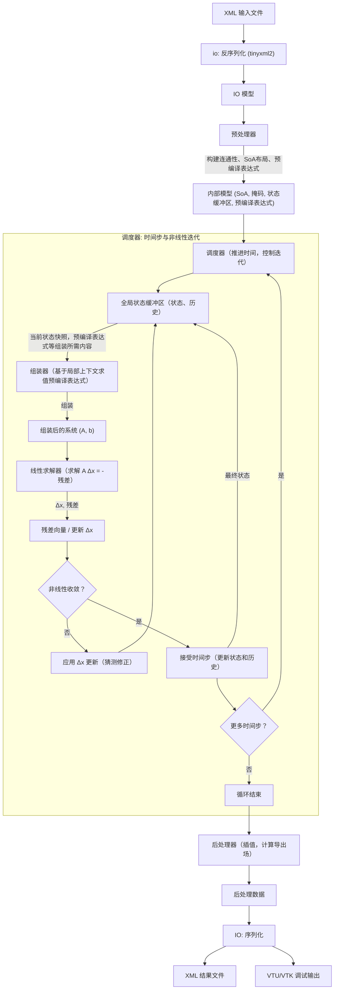

# MetaHotspot

## 规范

- 语言：C++20
- 构建系统：CMake
- 命名空间：主命名空间为 `mhs`, 领域子命名空间为 `mhs::core` / `mhs::sim` / `mhs::io` / `mhs::post` / `mhs::logger`。命名空间与目录解耦。模块内部，无需暴露的实现应该用匿名空间。
- 编译选项：严格（`/W4 /WX` 或 `-Wall -Wextra -Wpedantic -Werror`），第三方库除外。
- 通用设计模式：面向数据设计。尽可能使用 POD 和纯函数。无多层继承。无虚函数。
- 多线程：尽可能使用无锁数据结构。利用 tbb 进行多线程。
- 单元测试：每个模块一个测试套件，不要过于零碎。
- 回归测试：应包括单元测试和案例行为验证。结果须与直接从案例 XML 中读取的原始 FEM2 结果进行核对。可以使用 `pytest` 方便地进行回归测试。
- 要求完整工作流：从 XML 到 XML（写出结果）。但允许将结果导出为 VTU/VTK 等格式以进行验证。
- 日志：放弃原生流或格式化输入。应封装一个成熟的日志库（如 spdlog），以实现结构化、高性能的日志。默认级别应为 `INFO`。热循环中如需打印，则应该使用 `DEBUG`。
- 错误处理：绝不使用原生 C++ 异常。绝不进行 `try-catch`。程序应要么：
    - 记录错误并退出，用于不可恢复的错误，或
    - 明确记录回退行为的警告，并给出回退值。

## 架构

### 核心模块

- **data**（领域 `mhs::core`）：共享数据契约——域类型、IO 模型、内部模型。**纯头文件，不做独立库目标**。
    - `data/types.hpp` — `mhs::core::StudyType`、`mhs::core::BcType`、`mhs::core::FaceDir`、`mhs::core::FACE_DIRS` 等。
    - `data/io_model.hpp` — 直接镜像 XML schema 的 AoS 结构（`mhs::core::IOStructure`、`mhs::core::Variable`、`mhs::core::Rect`、`mhs::core::Block`、`mhs::core::Layer`、`mhs::core::Boundary`、`mhs::core::Material`、`mhs::core::FirstTypeThermalBC` 等）。
    - `data/internal_model.hpp` — 扁平化 SoA 内部模型（`mhs::core::InternalModel`、`mhs::core::MeshGeometry`、`mhs::core::MaterialProps`、`mhs::core::CellFields`、`mhs::core::BCParamTable`、`mhs::core::GlobalState`）。
- **common**（领域 `mhs::logger` / `mhs::utils`）：logger 与横切辅助函数。
    - `common/logger.hpp` / `logger.cpp` — `mhs::logger::{init, flush, debug, info, warn, error, panic}`，封装 spdlog。
    - `common/mesh_utils.hpp` — `mhs::utils::k_along` / `half_length_along` / `face_area` / `neighbor_*`，面法向查表。
    - `common/sample_point.hpp` — `mhs::utils::sample_*`，局部 3D 采样与外推辅助。
- **io**（领域 `mhs::io`）：XML 读取与序列化（VTU/VTK 调试输出）。`mhs::io::{read_xml, write_vtu, write_xml}` 均为自由函数。
- **preprocessor**（领域 `mhs::sim`）：将高层 IO 模型转换为优化的内部表示（结构化网格生成、连通性、SoA 布局、预编译表达式、cell-level BC 装配）。类 `mhs::sim::Preprocessor::load(IOStructure) → unique_ptr<InternalModel>`；主要逻辑以 `mhs::sim::{resolve_geometry, resolve_layers, resolve_face_keys, ...}` 等自由函数形式存在于同一命名空间。
- **assembler**（领域 `mhs::sim`）：消费内部模型配置和当前全局状态，一次 TBB 遍历返回 `AssemblyResult {K, f, M_diag}`，由 `TimeScheme::build_system` 注入时间离散。`mhs::sim::{Assembler, LinearSystem, AssemblyResult}`。TBB 并行。
- **linear_solver**（领域 `mhs::sim`）：线性求解器，使用工厂设计模式选择并实例化不同求解器。`mhs::sim::{LinearSolver, SolverType, SolverConfig, SolveResult, SparseLUSolver, BiCGSTABSolver, PardisoSolver}`。
- **nonlinear**（领域 `mhs::sim`）：非线性迭代求解（`mhs::sim::{NonLinearConfig, NonLinearResult, nonlinear_solve}`）。所有非线性控制参数（`underrelaxation` / `max_iterations` / 收敛容差）由 `NonLinearConfig` 持有，`nonlinear_solve` 通过可选参数接收；`Scheduler` 在每个时间步内调用 `nonlinear_solve` 直到收敛或达到模块内部的迭代上限。
- **scheduler**（领域 `mhs::sim`）：调度完整的求解流程，时间步推进。`mhs::sim::Scheduler`，方法 `setModel / setSolver / run / solution`。**不持有专属配置**：时间步 / 时长直接从 `InternalModel` 的 `study_type` / `transient_duration` / `transient_time_step` 读取；非线性参数由 `NonLinearConfig` 通过可选参数传入 `nonlinear_solve`。
- **postprocessor**（领域 `mhs::post`）：将求解向量转换为其他形式，单元到节点插值、计算最大/最小温度等导出量。纯计算，不做 IO。`mhs::post::interpolate_cell_to_node` / `max_temperature` / `min_temperature`（自由函数，非 class）。

### 工具模块

- **expr**（领域 `mhs::core`）：表达式解析与求值，封装 muparser。提供变量/函数注册池与基于 `FieldContext` 的求值。`mhs::core::{CompiledExpression, MuCompiled, register_native, make_constant, make_evaluator, eval, ...}`。
- **time_scheme**（领域 `mhs::sim::time_scheme`）：时间离散方案抽象。`mhs::sim::time_scheme::{TimeScheme, Bdf1Scheme, Bdf2Scheme, AdaptiveBdfScheme, TimeSchemeConfig, StepDecision, StepResult, create_scheme}`。

### 数据流

## 第三方依赖

- **CPM**：用于引入其余依赖项。
- **tinyxml2**：XML 解析和轻量级 DOM 操作。由 `io` 模块用于读取/写入 XML。
- **spdlog**：结构化、快速的日志记录，支持多种接收器（控制台、文件、系统日志）。由 `common` 模块（`mhs::logger`）封装。
- **muparser**：数学表达式解析和即时编译。由 `expr` 用于评估用户定义的函数、材料律、边界条件。
- **Eigen**：线性代数核心：稠密向量、稀疏矩阵（Eigen::SparseMatrix），以及内置求解器（SparseLU、ConjugateGradient、BiCGSTAB），可通过 `solver` 工厂选择。同时提供 SIMD 向量化和无矩阵功能。
- **GTest**：测试框架。每个模块一个测试套件。
- **tbb**: 用于并行化和 CPU 资源调度。

## 注意事项

- **通用设计**：你必须将所有问题都原生地视为非线性，以获得最佳通用性。所有问题均按瞬态设计。稳态时表达式求值取 `t=0`，调度器直接做非线性迭代（不推进时间）；瞬态从 `t=0` 起按时间步推进。瞬态和非线性迭代由 `scheduler` 驱动，`assembler` 无状态。
- **表达式特殊处理**：用户从前端定义的表达式函数奇怪地到处使用 `x` 作为变量，该变量实际上可以表示 `T`（如果出现在材料属性中）或 `t`（如果出现在热源等中）。应该在 `preprocessor` 中适当处理转换。
- **网格描述**：块（Blocks）由一系列添加/移除操作定义，仅在 XY 平面描述几何形状。层（Layers）由层的厚度定义，每个 Block 的 Z 范围默认继承其所在 Layer 的厚度（layer 0 支持 Block 级可变厚度 `thickness_expr`）。面或边界由特定的字符串表示定义，格式为 ``Face|Direction|CoordValue|X1_min,X1_max,Y1_min,Y1_max;X2_min,X2_max,Y2_min,Y2_max;...``，例如，`Z|E|0|0,50,50,100;50,100,0,50;50,100,50,100`。其中 CoordValue 是边界平面的空间坐标（不是层索引）。
- **内部使用结构化网格**：`preprocessor` 生成全局 3D 结构化网格，按层/材质标记每个单元（SoA 布局）。
- **边界条件**：采用 cell-centered 自由度，边界条件通过面积分直接施加到单元方程中，无需在面上额外存储 DOF。`preprocessor` 预计算每个面的 BC 类型和参数索引。
- **表达式求值**：`expr` 模块仅用于场/边界条件表达式，上下文为 `{T, t, x, y, z}`。几何表达式在 `preprocessor` 中求值为具体数值后构建网格，与场表达式求值分离。
- **材料属性、热源、边界条件参数**：支持任意函数形式的材料属性，上下文为 `{x, y, z, T, t}`。
- **变量绑定**：几何变量（如 `w_top`、`t_middle`）在预处理阶段解析为具体数值；场/边界条件表达式中不引用几何变量，仅使用 `{T, t, x, y, z}`。
