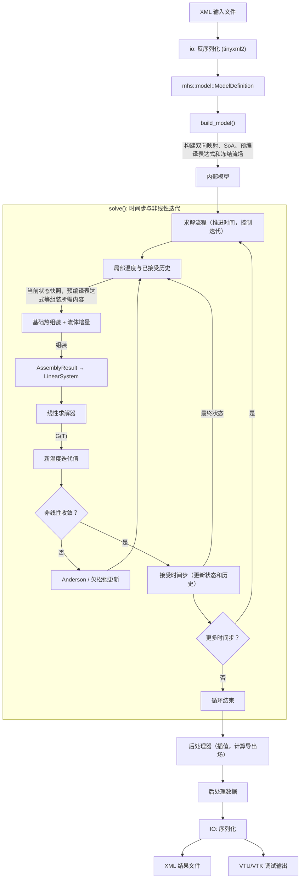

# MetaHotspot

## 规范

- 语言：C++17
- 构建系统：CMake
- 命名空间：主命名空间为 `mhs`, 领域子命名空间为 `mhs::model` / `mhs::core` / `mhs::sim` / `mhs::io` / `mhs::post` / `mhs::logger`。命名空间与目录解耦。模块内部，无需暴露的实现应该用匿名空间。
- 编译选项：严格（`/W4 /WX` 或 `-Wall -Wextra -Wpedantic -Werror`），第三方库除外。
- 通用设计模式：面向数据设计。尽可能使用 POD 和纯函数。无多层继承。
- 多线程：尽可能使用无锁数据结构。利用 tbb 进行多线程。
- 单元测试：每个模块一个测试套件，不要过于零碎。
- 回归测试：应包括单元测试和案例行为验证。结果须与直接从案例 XML 中读取的原始 FEM2 结果进行核对。可以使用 `pytest` 方便地进行回归测试。
- 要求完整工作流：从 XML 到 XML（写出结果）。但允许将结果导出为 VTU/VTK 等格式以进行验证。
- 日志：放弃原生流或格式化输入。应封装一个成熟的日志库（如 spdlog），以实现结构化、高性能的日志。默认级别应为 `INFO`。热循环中如需打印，则应该使用 `DEBUG`。
- 错误处理：模块可通过 `std::exception` 报告错误；CLI 入口统一捕获、记录并退出。可恢复问题应记录警告和回退值。

## 架构

### 构建目标

- **`mhs_model`**：轻量建模契约和 `ModelBuilder`，不依赖第三方库；Layer / Block / Rect / Boundary 的输入顺序是模型语义。
- **`mhs_runtime`**：header-only 的运行期数据契约与网格助手，作为 compiler、solver 和结果 IO 的稳定依赖边界。
- **`mhs_compiler`**：把有序 `ModelDefinition` 编译为运行期 SoA 模型，包含几何覆盖、材料/热源/边界表达式编译以及冻结流场构建。
- **`mhs_solver`**：消费运行期模型，负责热与流体组装、线性/非线性迭代、时间推进、探针和后处理。
- **`mhs_expression`**：muparser 与 TBB 封装；只在表达式实现变化时重编。
- **`mhs_linear`**：Eigen / MKL 线性求解封装；与建模代码的增量编译隔离。
- **`mhs_io`**：tinyxml2 适配以及 XML / VTU 输出；外部 FaceKey 格式不会进入建模或引擎层。
- **`mhs_logging`**：spdlog 封装。

运行期只划分一个无编译成本的契约层 `runtime` 和两个实现模块：`compiler` 完成 setup，`solver` 完成 solve。模块内按职责保留独立 `.cpp`，不再为 assembler、scheduler、fluid 等实现细节逐一建库。

### 数据流



## 运行

`metahotspot` 的命令行参数解析统一由 `mhs::cli`（`bin/cli.hpp`）完成，
所有标志都是命名、顺序无关的；不接受位置参数。

| Flag | 默认值 | 说明 |
|------|--------|------|
| `--input <file>` | —（必填） | 输入 XML |
| `--output-vtu <file>` | `./output.vtu` | VTU 输出路径 |
| `--output-xml <file>` | `./output.xml` | XML 输出路径 |
| `--fluid-overlay <file>` | 不加载；跳过所有流体相关逻辑 | 显式指定 fluid overlay；未传则不执行流体逻辑 |
| `--log-file <file>` | `metahotspot.log` | 日志文件路径 |
| `--no-console-log` | — | 关闭控制台日志 |
| `--help` | — | 打印帮助并以 0 退出 |

示例：

```bash
# 最常见的调用：只指定 input，不加载 fluid overlay
metahotspot --input cases/simple_steady_tests/steady_case1.xml

# 顺序无关：把 output-vtu 放最前也行
metahotspot --output-vtu /tmp/out.vtu \
            --output-xml /tmp/out.xml \
            --input   cases/simple_steady_tests/steady_case1.xml

# 显式指定 fluid overlay
metahotspot --input cases/.../case.xml --fluid-overlay cases/.../case_additional.xml
```

## 第三方依赖

- **CPM**：用于引入其余依赖项。
- **tinyxml2**：XML 解析和轻量级 DOM 操作。由 `io` 模块用于读取/写入 XML。
- **spdlog**：结构化日志，由 `mhs_logging`（`mhs::logger`）封装。
- **muparser**：数学表达式解析和即时编译。由 `mhs_expression` 用于评估用户定义的函数、材料律、边界条件。
- **Eigen**：稠密向量、稀疏矩阵，以及 EigenSparseLU / EigenBiCGSTAB 求解器。
- **GTest**：测试框架。每个模块一个测试套件。
- **tbb**: 用于并行化和 CPU 资源调度。

## 注意事项

- **通用设计**：你必须将所有问题都原生地视为非线性，以获得最佳通用性。所有问题均按瞬态设计。稳态时表达式求值取 `t=0`，调度器直接做非线性迭代（不推进时间）；瞬态从 `t=0` 起按时间步推进。瞬态和非线性迭代由 `scheduler` 驱动，`assembler` 无状态。
- **表达式特殊处理**：用户从前端定义的表达式函数奇怪地到处使用 `x` 作为变量，该变量实际上可以表示 `T`（如果出现在材料属性中）或 `t`（如果出现在热源等中）。应该在模型编译阶段适当处理转换。
- **网格描述**：块（Blocks）由一系列添加/移除操作定义，仅在 XY 平面描述几何形状。层（Layers）由层的厚度定义，每个 Block 的 Z 范围默认继承其所在 Layer 的厚度（layer 0 支持 Block 级可变厚度 `thickness`）。建模层用结构化 `FaceRegion` 描述边界；旧 XML 的 ``Face|Direction|CoordValue|...`` 编码只在 `io` 适配器内解析，其中 CoordValue 是边界平面的空间坐标（不是层索引）。
- **内部使用结构化网格**：`model_compiler` 生成全局 3D 结构化网格，按层/材质标记每个单元（SoA 布局）。
- **边界条件**：采用 cell-centered 自由度，边界条件通过面积分直接施加到单元方程中，无需在面上额外存储 DOF。模型编译阶段预计算每个面的 BC 类型和参数索引。
- **表达式求值**：`mhs_expression` 仅用于场/边界条件表达式，上下文为 `{T, t, x, y, z}`。几何表达式在模型编译阶段求值为具体数值后构建网格，与场表达式求值分离。
- **材料属性、热源、边界条件参数**：支持任意函数形式的材料属性，上下文为 `{x, y, z, T, t}`。
- **变量绑定**：几何变量（如 `w_top`、`t_middle`）在预处理阶段解析为具体数值；场/边界条件表达式中不引用几何变量，仅使用 `{T, t, x, y, z}`。
