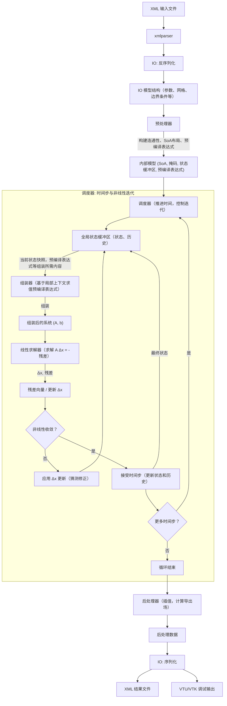

# MetaHotspot

## 规范

- 语言：C++20
- 构建系统：CMake
- 命名空间：主命名空间为 `mhs`, 每个模块一个命名空间例如 `mhs::general`。模块内部，无需暴露的实现应该用匿名空间。
- 编译选项：严格（`/W4 /WX` 或 `-Wall -Wextra -Wpedantic -Werror`），第三方库除外。
- 通用设计模式：面向数据设计。尽可能使用 POD 和纯函数。无多层继承。无虚函数。
- 多线程：尽可能使用无锁数据结构。利用 tbb 进行多线程。
- 单元测试：每个模块一个测试套件，不要过于零碎。
- 回归测试：应包括单元测试和案例行为验证。结果须与直接从案例 XML 中读取的原始 FEM2 结果进行核对。可以使用 `pytest` 方便地进行回归测试。
- 要求完整工作流：从 XML 到 XML（写出结果）。但允许将结果导出为 VTU/VTK 等格式以进行验证。
- 日志：放弃原生流或格式化输入。应封装一个成熟的日志库（如 spdlog），以实现结构化、高性能的日志。默认级别应为 `INFO`。热循环中如需打印，则应该使用 `DEBUG`。
- 错误处理：绝不使用原生 C++ 异常。绝不进行 `try-catch`。程序应要么：
    - 记录错误并退出，用于不可恢复的错误，或
    - 明确记录回退行为的警告，并给出回退值。

## 架构

### 核心模块

- **general**：自定义类型，公差、回退值等常量。
- **model**：核心数据结构。应包含两套，一套用于 IO（直接地反映配置项的结构），一套用于内部使用（扁平化的 SoA 设计，使用掩码数组、预编译表达式等，用于瞬态/非线性求解的全局状态缓冲区，组装时的上下文缓冲区……）。
- **io**：处理输入 XML 的读取（以及可能的额外输入文件）和输出 VTU/XML 的写入。使用 IO 专用结构进行解析和序列化。
- **preprocessor**：负责将高层模型转换为优化的内部表示。处理网格生成、连通性构建和数据布局优化。
- **assembler**：消费内部模型配置和当前全局状态，给出组装后的线性系统，即左侧矩阵 A 和右侧向量 b。应针对缓存局部性和向量化进行高度优化。
- **solver**：线性求解器，使用工厂设计模式选择并实例化不同求解器。
- **scheduler**：调度完整的求解流程，如非线性迭代和时间步进。协调求解器与组装器完成仿真循环。
- **postprocessor**：将求解向量转换为其他形式，如插值到节点、评估导出量等。

### 工具模块

- **expr**：处理表达式解析与求值。可封装第三方库如 `exprtk` 用于我们的场景。提供变量/函数/表达式注册池，并基于上下文进行求值。
- **xmlparser**：将 XML 解析为易于遍历并转换为 IO 模型结构的树状结构。可使用 `tinyxml2` 进行 XML 解析。
- **logger**：封装日志库（如 spdlog），为所有模块提供统一的日志接口。
- **utils**：不适合归入其他特定模块的通用实用函数。

### 数据流

## 第三方依赖

- **CPM**：用于引入其余依赖项。
- **tinyxml2**：XML 解析和轻量级 DOM 操作。由 `xmlparser` 和 `io` 用于读取/写入 XML。
- **spdlog**：结构化、快速的日志记录，支持多种接收器（控制台、文件、系统日志）。由 `logger` 模块封装。
- **exprtk**：数学表达式解析和即时编译。由 `expr` 用于评估用户定义的函数、材料律、边界条件。
- **Eigen**：线性代数核心：稠密向量、稀疏矩阵（Eigen::SparseMatrix），以及内置求解器（SparseLU、ConjugateGradient、BiCGSTAB），可通过 `solver` 工厂选择。同时提供 SIMD 向量化和无矩阵功能。
- **GTest**：测试框架。每个模块一个测试套件。
- **tbb**: 用于并行化和 CPU 资源调度。

## 注意事项

- 你必须将所有问题都原生地视为非线性，以获得最佳通用性。
- 用户从前端定义的表达式函数奇怪地到处使用 `x` 作为变量，该变量实际上可以表示 `T`（如果出现在材料属性中）或 `t`（如果出现在热源等中）。应该在 `preprocessor` 中适当处理转换。
- 块（Blocks）由一系列添加/移除操作定义。层（Layers）由一系列块和层的厚度定义。面或边界由特定的字符串表示定义，格式为 ``Face|Direction|LayerIndex|X1_min,X1_max,Y1_min,Y1_max;X2_min,X2_max,Y2_min,Y2_max;...``，例如，`Z|E|0|0,50,50,100;50,100,0,50;50,100,50,100`。
